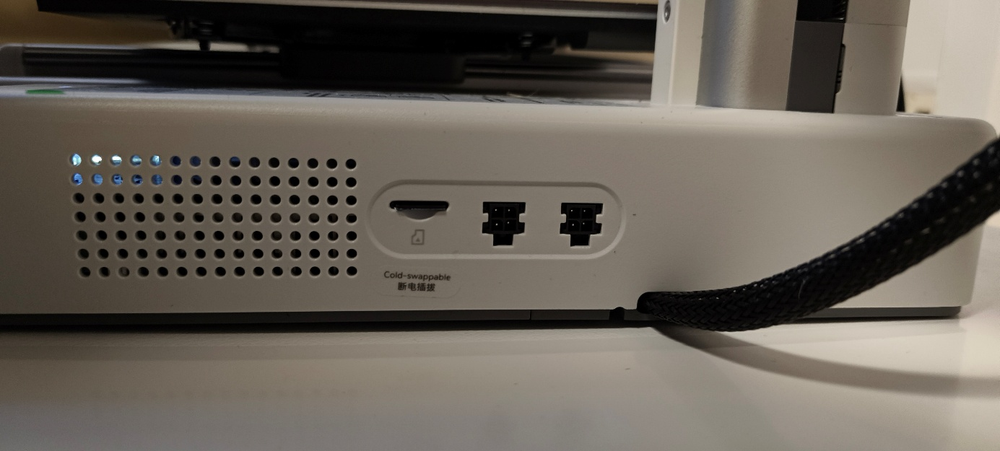

**Guide d\'utilisation - Bambu Lab A1 Mini**

**⚠️ RÈGLES DE SÉCURITÉ**

**TOUJOURS respecter ces consignes :**
-   Ne jamais toucher la buse ou le plateau chauffant si l'écran annonce qu'ils sont au-dessus de 35°C après il y a des risques de brulure.
-   Attendre que l\'imprimante soit complètement refroidie avant de retirer une pièce.
-   Ne jamais laisser l\'imprimante sans surveillance pendant les 10 premières minutes d'impression.
-   Prévenir un professeur en cas de problème.
-   Ne pas modifier les réglages de l\'imprimante sans autorisation.

**📱 INTERFACE DE L\'IMPRIMANTE**
**Écran tactile et boutons**

Température de la buse

Température du plateau

{width="1.9883727034120735in" height="1.073287401574803in"}
{width="2.883721566054243in" height="2.0458333333333334in"}

Les réglages ça tu n'as pas besoin d'y aller il ne faut pas modifier les paramètres.
L'assistant est la pour aider en cas de problème mineure
C'est ici que se trouve les ficher G-code pour lancer une impression

États du Wi-Fi

**Guide d\'utilisation - Bambu Lab A1 Mini**

**⚠️ RÈGLES DE SÉCURITÉ**

**TOUJOURS respecter ces consignes :**
-   Ne jamais toucher la buse ou le plateau chauffant si l'écran annonce qu'ils sont au-dessus de 35°C après il y a des risques de brulure.
-   Attendre que l\'imprimante soit complètement refroidie avant de retirer une pièce.
-   Ne jamais laisser l\'imprimante sans surveillance pendant les 10 premières minutes d'impression.
-   Prévenir un professeur en cas de problème.
-   Ne pas modifier les réglages de l\'imprimante sans autorisation.

**📱 INTERFACE DE L\'IMPRIMANTE**
**Écran tactile et boutons**

Température de la buse

Température du plateau

{width="1.9883727034120735in" height="1.073287401574803in"}{width="2.883721566054243in" height="2.0458333333333334in"}

Les réglages ça tu n'as pas besoin d'y aller il ne faut pas modifier les paramètres.

L'assistant est la pour aider en cas de problème mineure

C'est ici que se trouve les ficher G-code pour lancer une impression

États du Wi-Fi

Sur le coté droit se trouve le port pour la carte micro SD prend la pour mettre tes fichier G-code que tu as slicer.

ATTENTION SUR LES IMPRIMANTE 3D LA CARTE SE MET A L'ENVERS.

Cette interface sers à déplacer la tête d'impression de choisir la vitesse et de contrôler l'extrudeur. ATTENTION ELLE N'A PAS ÉTÉ FAITE POUR JOUER

Les ports AMS ils servent à connecter des système multi-couleur (AMS, AMS lite et AMS 2 Pro).

Quand tu change le filament va dans cette interface pour changer le type se matériaux et sa couleur, c'est aussi ici que tu dois aller pour charger et décharger une bobine.

{width="1.5145297462817149in" height="1.6110258092738408in"}

Le bouton d'alimentation, il se situe à l'arrière de l'imprimante.
ATTENTION IL NE FAUT PAS ETEINDRE L'IMPRIMANTE SI ELLE EST AU DESSUS DE 50°C POUR LAISSER LES VENTILATEURS FARE LEUR TRAVAIL

**📋 AVANT DE COMMENCER**
**Vérifications rapides**

Avant chaque utilisation, vérifier que :
-   L\'imprimante est branchée et allumée
-   Le plateau est bien positionné et propre (pas de résidus de plastique)
-   Il y a du filament chargé dans la machine
-   Personne d\'autre n\'utilise l\'imprimante
-   Je suis sur du matériaux que j'utilise

**🎯 ÉTAPE 1 : Charger le filament (si nécessaire)**

**Quand charger du filament ?**
-   Si la bobine est vide
-   Si vous devez changer de couleur/matériaux
-   Si le professeur vous le demande

**Comment faire ?**
1.  **Sur l\'écran tactile**, appuyez sur l\'icône **\"Charger filament\"**
2.  **Placez la bobine** sur le support en haut de l\'imprimante
3.  **Coupez le bout du filament** en biais à 45° (comme un crayon taillé)
4.  **Insérez le filament** dans le tube transparent jusqu\'à ce qu\'il rentre dans la machine
5.  **Attendez** que l\'imprimante chauffe et tire le filament automatiquement
6.  **Vérifiez** que du plastique sort de la buse (petit trou en bas)
7.  **Confirmez** sur l\'écran quand c\'est bon

⏱️ **Temps estimé :** 3-5 minutes

**🖥️ ÉTAPE 2 : Préparer votre fichier 3D**

**Sur l\'ordinateur avec Bambu Studio**

**Pour cette étape je te laisse suivre le protocole sur Github avec ce
lien**
**<https://github.com/Doume-20/bambu-studio-setup>**

**🚀 ÉTAPE 3 : Lancer l\'impression**

**Méthode 1 : Par Wi-Fi**
1.  Dans Bambu Studio, cliquez sur le bouton **\"Imprimer\"** (en haut à droite)
2.  Sélectionnez l\'imprimante A1 Mini de la salle 1, 2 ou 3
3.  Cliquez sur **\"Envoyer\"**
4.  L\'impression démarre automatiquement après préchauffage

**Méthode 2 : Par carte SD (Conseillé)**
1.  Enregistrez le fichier sur la carte microSD
2.  Retirez la carte de l\'ordinateur
3.  Insérez-la dans l\'imprimante (elle se met à l'envers dans l'imprimante)
4.  Sur l\'écran tactile, allez dans **\"Fichiers\"**
5.  Sélectionnez votre fichier et appuyez sur **\"Imprimer\"**

**👀 ÉTAPE 4 : Surveiller l\'impression**

**Les 10 premières minutes sont CRITIQUES**
**Restez devant l\'imprimante et observez :**

✅ **Ce qui est NORMAL :**
-   L\'imprimante fait du bruit (c\'est normal)
-   La buse se déplace rapidement
-   Le plastique sort en lignes régulières
-   La première couche colle bien au plateau

❌ **Ce qui est ANORMAL (prévenez le professeur) :**
-   Le plastique ne colle pas et fait des \"spaghettis\"
-   La buse frotte contre l\'impression
-   Rien ne sort de la buse
-   L\'imprimante fait un bruit bizarre ou s\'arrête
-   Le filament est emmêlé

**Pendant l\'impression**
-   Vous pouvez partir après les 10 premières minutes si tout va bien
-   Revenez de temps en temps vérifier que tout se passe bien
-   Notez l\'heure de fin prévue

**✅ ÉTAPE 5 : Récupérer votre impression**
**Attendre le refroidissement**

⚠️ **IMPORTANT : NE JAMAIS toucher le plateau tant qu\'il est chaud !**

1.  Attendez que l\'imprimante ait fini et refroidi (température \<40°C)
2.  Le plateau refroidit en 5-10 minutes environ

**Retirer la pièce**
1.  **Retirez le plateau** (il se clippe facilement)

2.  **Décollez la pièce** :
    -   Pliez légèrement le plateau flexible
    -   La pièce devrait se décoller facilement
    -   Si elle résiste, utilisez une spatule en plastique (jamais de métal vous risquer d'abimer le plateau et la pièce !)

3.  **Remettez le plateau** en place sur l\'imprimante
**Nettoyer les supports**

Si votre pièce a des supports :
-   Retirez-les délicatement avec vos mains ou une pince
-   Jetez les supports dans le bac prévus pour.

**🧹 APRÈS L\'IMPRESSION : Rangement**
**Checklist de fin :**

-   \[ \] Pièce récupérée
-   \[ \] Plateau remis en place et propre
-   \[ \] Déchets jetés
-   \[ \] Zone de travail rangée
-   \[ \] Fichier enregistré/supprimé de l\'ordinateur si demandé

**⚠️ PROBLÈMES FRÉQUENTS**

**L\'impression ne colle pas au plateau**
**Solution :** Appelez le professeur

-   Le plateau doit peut-être être nettoyé la poussière est le principale problème.

**Le filament ne sort pas**
**Solution :** Vérifiez que :

-   La bobine n\'est pas vide
-   Le filament n\'est pas emmêlé ou cassé
-   Appelez le professeur si le problème persiste

**L\'impression est ratée**
**Solution :**

-   Notez ce qui n\'a pas marché
-   Montrez au professeur
-   Ne lancez pas une nouvelle impression sans avoir compris le problème

**Message d\'erreur sur l\'écran**
**Solution :** Prenez une photo et appelez le professeur

**💡 CONSEILS POUR RÉUSSIR**

1.  **Anticipez le temps** : Une impression peut prendre plusieurs heures
2.  **Commencez petit** : Testez avec des objets simples avant les projets complexes
3.  **Orientez bien votre pièce** : La face la plus plate doit être sur le plateau
4.  **Surveillez le début** : 90% des échecs arrivent dans les premières minutes
5.  **Soyez patient** : L\'impression 3D est lente mais précise

**📞 EN CAS DE PROBLÈME**

1.  **Ne paniquez pas**
2.  **Ne touchez pas l\'imprimante si vous ne savez pas quoi faire**
3.  **Appelez le professeur**
4.  **Expliquez calmement ce qui s\'est passé**

**Bon courage et amusez-vous bien ! 🎉**

*L\'impression 3D demande de la patience et de la pratique. Ne vous découragez pas si vos premières impressions ne sont pas parfaites !*